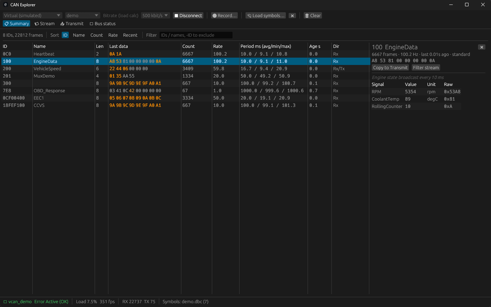
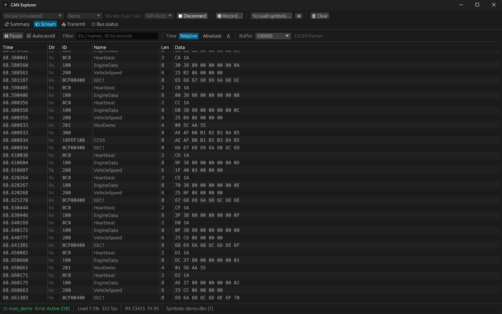
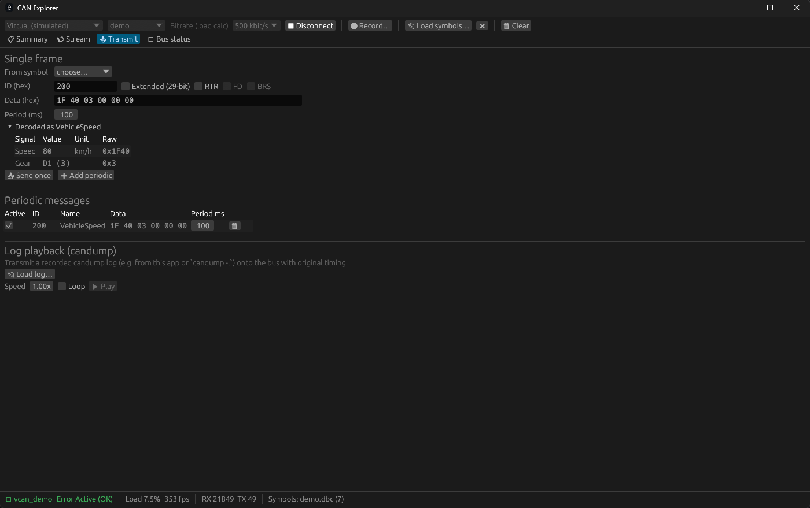
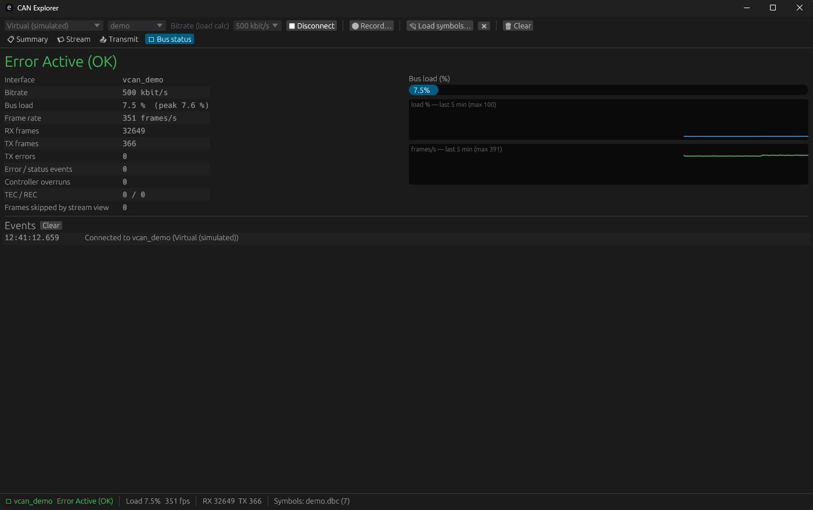

# CAN Explorer

A CAN bus viewer for Windows, macOS and Linux, built with Rust and egui.

- **Summary**: one row per ID with an exact frame count, rate, average/min/max period, age and last data. Bytes that changed recently are highlighted. Click a row to see its decoded signals.
- **Stream**: a live, filterable list of frames. Times can be shown as relative, absolute or delta.
- **Recording**: saves every frame to a `candump -L` log file. The file can be replayed here or with can-utils `canplayer`.
- **Symbols**: loads Vector **DBC** or PEAK **SYM** files to name messages and decode signals, including multiplexed signals and value tables.
- **Decoded values**: with a symbol file loaded, the Summary table shows each signal on its own line, and the Stream table gets a one-line *Decoded* column. Values have a fixed width and decimal count worked out from the signal definition (bit size, sign, factor, offset), so digits stay in place as values change. The **Signals** tab lists every signal with its value, unit, min/max, raw bits, update count and a history plot. Signal values are decoded in the bus thread, so min/max and history include every frame.
- **Transmit**: sends one-off frames, sends periodic frames, and plays back candump logs with their original timing (with speed control and looping).
- **Bus status**: shows controller state (active / warning / passive / bus-off), TEC/REC, bus load %, frame rate, error events and overruns, and a 5-minute history.

> [!WARNING]
> This was originally generated with Claude Opus but edited/refined by me personally. This is the definition of "vibe-coded" but hey it works and did what I needed to do without costing an arm and a leg :shrug:

## Screenshots

All screenshots use the built-in virtual bus with [`examples/demo.dbc`](examples/demo.dbc) loaded.

### Summary

Every ID seen on the bus, with exact counts and timing. Recently changed bytes are highlighted in orange. The selected message's signals are decoded in the side panel. `200 VehicleSpeed` shows `Rx/Tx` because the app is also transmitting it.



### Stream

The live frame list with symbol names. Transmitted frames are marked `Tx` in blue.



### Transmit

A frame entered by hand, decoded with the loaded DBC before sending, and running as a 100 ms periodic message. Log playback is below it.



### Bus status

Controller state, error counters, bus load and frame-rate history, and the event log.



## Supported interfaces

| Backend | Windows | Linux | macOS | Notes |
|---|---|---|---|---|
| PEAK PCAN (USB/PCI/LAN) | ✅ | ✅ | ✅* | Needs the PEAK driver. `PCANBasic.dll` / `libpcanbasic.so` is loaded at runtime. *macOS uses MacCAN `libPCBUSB.dylib`. |
| Kvaser CANlib | ✅ | ✅ | – | Needs the Kvaser driver (`canlib32.dll` / `libcanlib.so`). |
| SocketCAN | – | ✅ | – | Configure the bitrate with `ip link set can0 type can bitrate 500000 && ip link set can0 up`. |
| SLCAN (serial) | ✅ | ✅ | ✅ | CANable, USBtin and other Lawicel-protocol adapters. |
| Virtual | ✅ | ✅ | ✅ | Simulated traffic (`demo`, `stress` ≈ 10k fps, `quiet`). |
| Log file | ✅ | ✅ | ✅ | Replays a candump log into the viewer for offline review, at 0.25x–100x or max speed. |

Vendor libraries are loaded when you connect, not at build time. The app builds and runs without any vendor SDK installed.

## Download

Prebuilt binaries for Windows (x86_64), Linux (x86_64) and macOS (universal: Intel + Apple Silicon) are attached to each [GitHub release](https://github.com/HonakerM/CAN-Explorer/releases).

- **macOS:** the binary isn't signed. After extracting, run `xattr -d com.apple.quarantine can_explorer` once, or right-click → Open.
- **Linux:** run `chmod +x can_explorer` if needed.

To publish a release, push a version tag. [`.github/workflows/release.yml`](.github/workflows/release.yml) builds and tests on all three platforms, then creates the release with the archives and `SHA256SUMS.txt`. Tags that contain a `-` (e.g. `v0.2.0-rc1`) are marked as pre-releases.

```bash
git tag v0.1.0 && git push origin v0.1.0
```

## Build & run

```bash
cargo run --release
```

On Linux, the file dialogs use the XDG desktop portal (`xdg-desktop-portal` with a GTK or KDE backend).

To try it without hardware, choose **Virtual → demo**, click **Connect**, then **Load symbols…** → `examples/demo.dbc`.

## Architecture: why the summary never misses frames

```
 device (PCAN/Kvaser/SocketCAN/SLCAN/…)
        │
   bus thread  ──►  Summary (per-ID stats, mutex)      ← every frame
        │      ──►  recording file (BufWriter)         ← every frame
        │      ──►  bounded channel ──► UI stream view ← may drop if the UI falls behind (counted)
        ▲
   commands (send / periodic / replay / record)
```

A dedicated bus thread owns the device. It reads frames in bursts. For each burst it updates the per-ID summary under one lock and writes the recording file. Only after that does it offer frames to the UI stream through a bounded channel. If the UI can't keep up, the stream view skips frames. The summary, counters and recording still include every frame, and the number skipped is shown in the status bar.

Transmitted frames (single, periodic and replayed) go through the same path, so they appear in the summary and the recording marked as `Tx`.

## Source layout

| File | Purpose |
|---|---|
| `src/device.rs` | `CanDevice` trait and all backends |
| `src/bus.rs` | Bus thread, shared summary and statistics, TX scheduling, recording |
| `src/symbols.rs` | DBC (via `can-dbc`) and SYM parsers, signal decoding |
| `src/candump.rs` | candump log read/write |
| `src/app.rs` | egui UI |

## Tests

```bash
cargo test --release
```

Includes an end-to-end test. It runs the ~10k fps simulated bus without reading the stream, then checks that summary counts, RX/TX totals, recorded lines and stream received plus skipped all agree.
